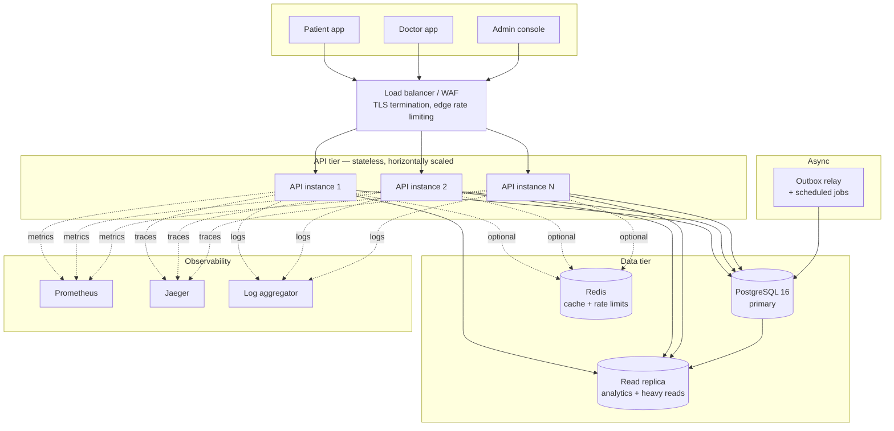
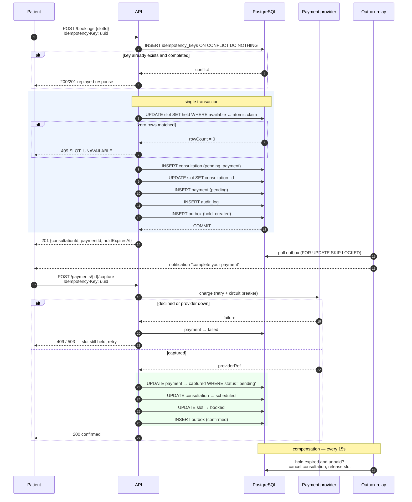
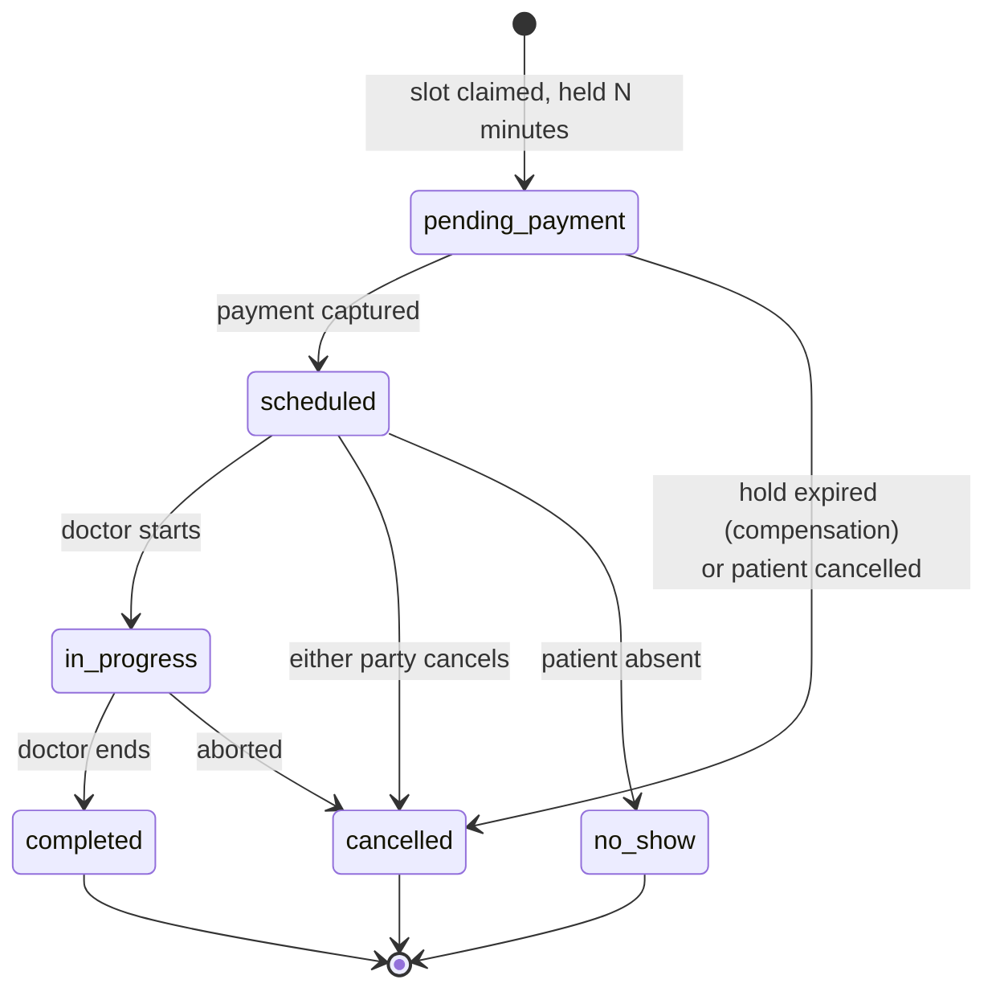
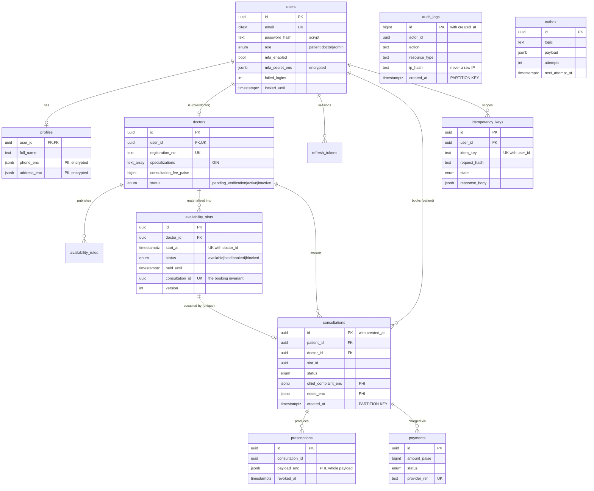

# Architecture

Amrutam Telemedicine backend — consultations, doctor availability, prescriptions.

Targets: 100k consultations/day, p95 < 200 ms reads and < 500 ms writes, 99.95% availability.

---

## 1. Shape of the system, and why

### 1.1 A modular monolith, not microservices

100k consultations/day is **~1.2 writes/sec averaged**. Indian telemedicine traffic peaks hard
around 09:00–11:00 and 19:00–22:00, so assume 10× the mean: **~12 writes/sec** at peak, with
reads roughly 20:1 against writes, so **~250 reads/sec**.

A single Postgres instance on modest hardware handles that with room to spare. Splitting this
into services would buy independent scaling nobody needs yet, and cost distributed transactions
across the booking flow — the one place in this system where correctness is genuinely hard.

So: **one deployable, hard module boundaries inside it.**

```
src/modules/<domain>/
  ├── <domain>Routes.ts       HTTP: validation, authorisation, status codes
  ├── <domain>Service.ts      business rules, transactions — no HTTP, no SQL strings in the logic
  └── <domain>Repository.ts   SQL, and nothing else
```

Modules talk through service interfaces and domain events, never by reaching into each other's
tables. That is the property that makes extraction possible later: when booking genuinely needs
its own scaling envelope, it already has a seam to cut along. **ADR-0001** records this decision
and the conditions under which it should be revisited.

Dependencies are constructed in `src/container.ts` and passed down — so a test can build the same
graph with a fake repository or a payment provider that always fails.

### 1.2 Container view



The API tier holds no state: sessions are JWTs, rate-limit counters are in Redis, and the hold
timer is a database column, not an in-process timer. Any instance can serve any request, and
losing one loses nothing but its in-flight requests.

**Redis is optional by design.** `src/cache/redis.ts` fails soft on every operation and the rate
limiter fails open. Making a request path depend on the cache converts a cache outage into a
service outage, and 99.95% does not survive that.

---

## 2. The booking flow

This is the core of the system and the only place where concurrency correctness is load-bearing.

### 2.1 The problem

Two patients open the same 10:00 slot and tap Book simultaneously. Both read "available". Both
write a consultation. The doctor is double-booked, both patients are charged, and nobody finds
out until someone joins an empty call.

### 2.2 Approaches that do not work

| Approach | Why it fails |
|---|---|
| `SELECT` status, then `INSERT` | There is a window between the two statements. Under READ COMMITTED both transactions see the pre-write state. This is the bug, not the fix. |
| `SELECT … FOR UPDATE`, then `UPDATE` | Correct, but holds a row lock across application round trips. The queue that forms lands directly in p95. |
| Advisory lock per slot | Also correct, also serialising, and it moves the invariant out of the schema into a convention that nothing enforces. |
| Redis `SETNX` lock | Makes booking correctness depend on the cache being up. Redis is explicitly the component allowed to fail. |

### 2.3 What is implemented

A single conditional `UPDATE` carrying its own precondition:

```sql
UPDATE availability_slots
   SET status = 'held', hold_token = gen_random_uuid(),
       held_by = $2, held_until = now() + make_interval(mins => $3),
       version = version + 1
 WHERE id = $1
   AND consultation_id IS NULL
   AND (status = 'available' OR (status = 'held' AND held_until < now()))
RETURNING id, doctor_id, start_at, end_at;
```

Postgres evaluates that predicate while holding the row lock it just acquired, so **exactly one**
concurrent statement can match. The loser gets `rowCount = 0` — not an exception, not a stale
read, just a fact — and returns `409 SLOT_UNAVAILABLE`. One round trip, no application lock, no
retry loop.

Two database-level backstops sit underneath, so the invariant survives a future caller that
bypasses the service:

- `uq_slot_per_doctor UNIQUE (doctor_id, start_at)` — a doctor cannot have two slots at one instant.
- `uq_slot_consultation UNIQUE (consultation_id) WHERE consultation_id IS NOT NULL` — a slot holds
  at most one consultation.

> **Where the invariant is deliberately *not* enforced.** `consultations` is range-partitioned, and
> a unique index on a partitioned table must include the partition key. `UNIQUE (slot_id, created_at)`
> would therefore permit two rows with the same `slot_id` and different timestamps — the exact thing
> it appears to forbid. Writing it would be worse than writing nothing, because it reads like a
> guarantee. The constraint lives on `availability_slots`, which is not partitioned.

Verified by `test/integration/booking.concurrency.test.ts`: **50 simultaneous bookings for one
slot → exactly 1 × 201 and 49 × 409**, with the database asserted afterwards.

### 2.4 Sequence



### 2.5 Saga and compensation

Booking spans a local transaction and a third-party call, so it cannot be one ACID transaction.
It is an **orchestrated saga** whose state lives in `consultations.status`:



The compensating action is `bookingService.releaseExpiredHolds()`, a sweep every 15 seconds rather
than a per-hold timer — timers do not survive a restart, and at this volume there would be tens of
thousands outstanding. The transition table is in `consultationService.ts` and asserted by unit
tests, so an illegal transition is unreachable rather than merely unlikely.

Refunds are handled as a reaction to `consultation.cancelled`, not inline: only a *captured*
payment owes one, and that decision belongs where it can be retried.

---

## 3. Data model



Money is `bigint` paise, never a float. Currency arithmetic in IEEE-754 is how you end up one
paisa short on a reconciliation report.

---

## 4. Scale

### 4.1 Partitioning

`consultations` and `audit_logs` are **range-partitioned by month** (`src/db/migrations/002_partitions.sql`).
At 100k/day, consultations reach ~36M rows/year and audit logs several times that. Monthly
partitions keep index depth and autovacuum bounded, let most queries prune to one or two
partitions, and make retention a `DETACH` — O(1) — instead of a mass `DELETE` and the vacuum debt
that follows.

Partitions are created **three months ahead** by a daily job. A missing partition is not a slow
insert, it is a failed one, so the job runs far more often than the boundary it protects.

**When one Postgres is no longer enough** (~10× current projections), the shard key is `doctor_id`:
availability, slots and consultations all hang off it, so a doctor's entire working set stays on
one shard and the booking transaction stays local. Sharding on `patient_id` would split exactly
the rows the booking transaction needs to touch together.

### 4.2 Caching

| Key | TTL | Invalidated by |
|---|---|---|
| `doctor:{id}` | 5 min | profile update, verification |
| `search:doctors:{hash}` | 60 s | any doctor write (prefix sweep) |
| `slots:{doctorId}:{range}` | 30 s | booking, cancellation, rule change (prefix sweep) |
| `analytics:overview` | 5 min | TTL only |

Cache-aside throughout. Slot availability gets the shortest TTL because it is the most-read and
fastest-changing resource, and a stale slot costs the patient a 409 at booking time. TTLs are a
*backstop* against a missed invalidation, not the primary mechanism.

Invalidation happens **after commit**, never inside the transaction: invalidating early lets a
concurrent read repopulate the cache from pre-commit state and leaves it stale indefinitely.

Prefix invalidation uses `SCAN`, never `KEYS` — `KEYS` blocks Redis's single thread across the
whole keyspace, which on a warm cache is a self-inflicted multi-second stall.

### 4.3 Concurrency, in one table

| Contention point | Mechanism |
|---|---|
| Two patients, one slot | Conditional `UPDATE` with the precondition in `WHERE` |
| Duplicate request retried | `idempotency_keys`, insert-first with `ON CONFLICT DO NOTHING` |
| Duplicate payment capture | `UPDATE … WHERE status = 'pending'` — a second capture matches nothing |
| Concurrent failed logins | Counter incremented and lock decided in SQL, not read-modify-write |
| Multiple outbox workers | `SELECT … FOR UPDATE SKIP LOCKED` |
| Two instances migrating | `pg_advisory_lock` |
| Slot generation re-run | `ON CONFLICT (doctor_id, start_at) DO NOTHING` |

The pattern throughout: **let the database decide, once, under its own lock.**

### 4.4 Transactions

Default isolation is READ COMMITTED. Nothing here needs SERIALIZABLE, because every invariant is
expressed as a constraint or a conditional update rather than as a read-then-write.

Transactions are opened by services via `withTransaction`, and repositories accept an optional
client — so the same repository method composes into a transaction or runs standalone. Audit rows
for state changes are written **inside** the transaction (`auditInTransaction`): there must be no
window in which a consultation exists with no record of who created it.

---

## 5. Reliability

### 5.1 Retry and backoff

`src/lib/retry.ts` implements **exponential backoff with full jitter**:
`delay = random(0, min(maxMs, baseMs × 2ⁿ))`.

Equal-jitter and fixed schedules re-synchronise every client that failed at the same moment, so a
recovering dependency is immediately hit by a thundering herd. Full jitter spreads them; it is the
variant AWS recommends and it measurably reduces total client wait.

Retries are **classified, not blanket**: a declined card is a terminal answer, and retrying it only
delays the user's real error. A provider timeout is retried.

| Operation | Attempts | Base | Cap | Notes |
|---|---|---|---|---|
| Payment capture | 3 | 100 ms | 2 s | Behind a circuit breaker; declines not retried |
| Outbox delivery | 8 | 2ⁿ s | 1 h | Dead-letters to `status='dead'`, kept for inspection |
| Migration at boot | 10 | 500 ms | 15 s | Readiness stays false meanwhile |

A **circuit breaker** (5 failures → open 30 s → half-open probe) fronts the payment provider.
Retries alone make an outage worse; the breaker converts a slow cascading failure into a fast
local one, which is what keeps the latency promise honest when a third party is down.

### 5.2 Idempotency

Required on every unsafe write: `POST /bookings`, `POST /bookings/{id}/cancel`,
`POST /payments/{id}/capture`, `POST /prescriptions`. Missing header → `400`.

The mechanism is insert-first, and the reason matters: a `SELECT`-then-`INSERT` has a window in
which two concurrent requests both see "no existing key" and both proceed. Losing the insert race
resolves to one of three outcomes:

- stored request hash differs → `422 IDEMPOTENCY_KEY_REUSE`
- winner finished → replay its exact stored response, with `Idempotency-Replayed: true`
- winner still running → `409 IDEMPOTENT_REQUEST_IN_PROGRESS`

Only 2xx responses are stored. A 4xx is a client error a corrected retry should be able to fix; a
5xx may not have completed its side effects. In both cases the key is released rather than pinned
to a response that would be wrong to repeat. Keys are scoped `(user_id, key)` and expire after 24h.

### 5.3 Graceful shutdown

SIGTERM → stop accepting connections → drain in-flight requests → stop workers → close pools →
exit, with a 15-second force-exit backstop. On a rolling deploy this is the difference between a
deploy nobody notices and a burst of 502s — which, repeated across deploys, is most of a 99.95%
error budget.

### 5.4 Availability arithmetic

99.95% allows **~21.6 minutes of downtime per month**. That budget is spent on:

- deploys — zero-downtime via rolling restarts and graceful shutdown, so ~0
- Postgres failover — managed service with automatic failover, ~30–60 s per event
- schema migrations — additive and backwards-compatible, never blocking
- dependency failure — Redis and the payment provider degrade rather than fail the service

---

## 6. Observability

**Metrics** (`/metrics`, Prometheus): RED on every route, plus `booking_attempts_total{outcome}`,
`idempotent_replays_total`, `outbox_pending`, `slot_holds_active`, `auth_events_total{event,outcome}`.
Histogram buckets are placed around the SLO thresholds (0.15/0.2/0.3 and 0.5) rather than spread
logarithmically, because that is where the alert fires. Route labels use the matched Express path,
never the raw URL — per-id labels would blow up cardinality.

**Logs**: pino JSON, correlated by `requestId` carried in `AsyncLocalStorage` so no function
signature grows two parameters it does not care about. The redact list covers passwords, tokens,
MFA secrets, and clinical fields — in a health system a stray `logger.info({ body })` is a
disclosure, not a debug line.

**Traces**: OpenTelemetry auto-instrumentation for HTTP, Postgres and Redis, exported OTLP to
Jaeger. Health and metrics scrapes are filtered out. Tracing is behind a flag and fails open: an
unreachable collector must never stop the service booting.

**Alerts** (`observability/alerts.yml`) are derived from the SLOs and each names the user-visible
symptom it protects. An alert that cannot be traced to something a patient would notice is noise,
and noise is what makes on-call ignore the page that matters.

---

## 7. Backup and disaster recovery

**RPO ≤ 5 minutes. RTO ≤ 30 minutes.**

| Layer | Strategy |
|---|---|
| Postgres | Managed daily snapshots + continuous WAL archiving → PITR to any second in a 30-day window |
| Cross-region | WAL shipped to a second region; snapshots replicated |
| Redis | Not backed up — it is a cache by design, and a cold start is a latency event, not data loss |
| Secrets | In the platform secret store, versioned and separately backed up; never in the repo |
| Object storage | Versioning plus a deletion lock on the audit archive |

**Restore procedure**

1. Provision from the latest snapshot in the surviving region.
2. Replay WAL to the chosen recovery point.
3. Run `npm run migrate` — idempotent and checksum-verified, safe on a restored volume.
4. Point the API at the restored primary; readiness gates traffic until migrations confirm.
5. Redis starts empty and refills; the first minutes are slower, not wrong.

**Failure modes and responses**

| Failure | Response | User impact |
|---|---|---|
| One API instance | Load balancer removes it | None |
| Postgres primary | Managed failover to standby | 30–60 s of write errors |
| Redis | Fail-soft to Postgres | Slower reads |
| Payment provider | Circuit opens | Bookings held, not lost; patient retries |
| Region loss | Promote cross-region replica | RTO 30 min, RPO 5 min |
| Bad deploy | Roll back to the previous image | Bounded by rollback time |
| Accidental mass delete | PITR to just before the statement | Data loss bounded by RPO |

Restores are exercised quarterly against a scratch environment. A backup that has never been
restored is a hypothesis, not a backup.

---

## 8. What is deliberately not built

Stated plainly rather than left to be discovered:

- **Real payment gateway.** `MockPaymentProvider` implements `PaymentProvider`; a real integration
  is one class. Everything *around* it — retry schedule, circuit breaker, saga compensation,
  idempotency — is real.
- **Video/WebRTC media.** Out of scope; `mode` is modelled, signalling is not.
- **Notification delivery.** Events flow through the outbox with retry and dead-lettering; the
  handlers log rather than call SendGrid or Twilio.
- **Read replica routing.** Analytics queries are written to be replica-safe and the topology is
  designed, but the connection split is not wired.
- **Managed KMS.** Envelope encryption with per-record data keys and a `kid` column is implemented;
  the master key comes from an environment variable rather than KMS. The rotation procedure is in
  `docs/security-checklist.md` and does not change when KMS is added.

---

## 9. Decision records

- [ADR-0001 — Modular monolith over microservices](adr/0001-modular-monolith.md)
- [ADR-0002 — Conditional UPDATE for slot concurrency](adr/0002-slot-concurrency.md)
- [ADR-0003 — Insert-first idempotency keys](adr/0003-idempotency.md)
- [ADR-0004 — Envelope encryption for PHI](adr/0004-phi-encryption.md)
