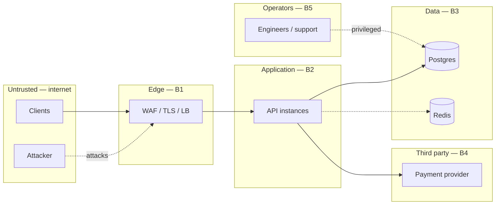

# Threat model

STRIDE, per trust boundary. Scope: the API, its database, its cache and the payment integration.

---

## 1. Data classification

Controls follow the classification; everything else in this document depends on this table.

| Class | Data | At rest | In transit | Logged? | Retention |
|---|---|---|---|---|---|
| **C4 — Clinical (PHI)** | Diagnoses, symptoms, clinical notes, prescriptions | Envelope-encrypted, per-record DEK | TLS 1.3 | **Never** — field names redacted | 7 years (medical record law), then crypto-shredded |
| **C3 — Sensitive PII** | Phone, address, DOB, MFA secrets | Envelope-encrypted | TLS 1.3 | Never | Account life + 90 days |
| **C2 — Identifying** | Name, email, doctor registration no. | Plaintext (queryable) | TLS 1.3 | User id only, never email | Account life + 90 days |
| **C2 — Financial** | Amounts, payment status, provider refs | Plaintext | TLS 1.3 | Amounts only | 7 years (tax) |
| **C1 — Operational** | Audit logs, metrics, request ids | Plaintext, append-only | TLS 1.3 | Yes, by design | 2 years |
| **C0 — Public** | Doctor listings, specialisations, fees | Plaintext, cached | TLS | Yes | — |

Card details are **never** in scope: the payment provider is tokenised, and no PAN touches this
system.

---

## 2. Trust boundaries

- **B1 Internet → Edge** — anonymous, hostile by default.
- **B2 Edge → App** — authenticated, but a valid token is not a trusted user.
- **B3 App → Data** — the database trusts the app completely; app compromise is total.
- **B4 App → Third party** — an external service can be slow, wrong or breached.
- **B5 Operators → Data** — the boundary most often ignored, and the one behind most real health-data breaches.

---

## 3. STRIDE

### Spoofing

| Threat | Mitigation | Residual |
|---|---|---|
| Credential stuffing against login | scrypt (memory-hard), lockout after 5 failures / 15 min, per-IP rate limit, identical error for unknown-account and wrong-password | Distributed low-and-slow attack — needs edge intelligence |
| Stolen refresh token used indefinitely | Single-use rotation with **reuse detection**: replaying a used token revokes the entire family | Attacker has one access-token lifetime (15 min) before the real user triggers detection |
| Forged JWT | HS256 with the algorithm **pinned** at verification, so `alg: none` and algorithm confusion are rejected; issuer and audience checked | Master secret compromise — mitigated by rotation |
| Session theft on a privileged account | **MFA mandatory** for doctor and admin roles; TOTP verified server-side | Real-time phishing proxy — would need WebAuthn to close |
| Account enumeration at registration | Necessarily an existence oracle; mitigated by rate limiting rather than a misleading 201 | Accepted and documented |

### Tampering

| Threat | Mitigation |
|---|---|
| SQL injection | Every value is a bind parameter. The only interpolated fragments are `ORDER BY` and `date_trunc`, both selected from closed maps (`SORT_COLUMNS`, `GROUP_TRUNC`) keyed by a validated enum — never by user input |
| Mass assignment (`{"role":"admin"}` on a profile update) | Zod strips unknown keys and handlers read `req.valid.body`, never `req.body` |
| Modifying the audit trail to hide activity | `audit_logs` has a `BEFORE UPDATE OR DELETE` trigger that raises. Enforced by the database, asserted by a test |
| Tampering with encrypted fields in the database | AES-GCM is authenticated — tampered ciphertext fails to decrypt rather than returning plausible values |
| Price manipulation via the request body | Fees are read from the `doctors` row inside the transaction; the client never supplies an amount |
| Oversized payload | 100 kb JSON limit; every array and string bounded by schema |

### Repudiation

| Threat | Mitigation |
|---|---|
| "I never issued that prescription" | Append-only audit log with actor, role, request id, hashed IP and user agent for every clinical write **and read** |
| "I never cancelled that booking" | `cancelled_by` persisted; audit row written inside the same transaction |
| Admin denies viewing a record | Reads are audited too — a write-only log cannot answer "who looked at this?", which is the question an audit is for |

### Information disclosure

| Threat | Mitigation | Residual |
|---|---|---|
| **Broken object-level authorisation** (OWASP API #1) | Ownership is checked against the **row**, not just the role. A non-participant gets `404`, not `403`, so ids cannot be probed | Requires discipline on every new endpoint — covered by review |
| Database dump | PHI/PII envelope-encrypted; master key not in the database | Attacker with both DB and key access |
| PHI in logs | Explicit pino redact list; audit metadata records counts and lengths, never content | A new field name not added to the list |
| PHI in error responses | 5xx returns a fixed message and a request id; details only for 4xx | — |
| Verbose framework fingerprinting | `x-powered-by` disabled, helmet defaults tightened | — |
| Cross-origin credential theft | CORS is an **allow-list**; origin is never reflected. `origin: true` with credentials is the classic account-takeover misconfiguration | — |
| Raw IPs in the database | Only salted HMAC (`hashIp`) is ever stored | — |
| `/metrics` exposed publicly | Bound to the metrics network in production, not the public ingress | Misconfiguration — covered in the deploy checklist |

### Denial of service

| Threat | Mitigation | Residual |
|---|---|---|
| Request flood | Edge rate limiting plus per-user and per-IP application limits with distinct buckets | Volumetric DDoS — edge concern |
| Login brute force as DoS on a victim | Lockout is per account with a time bound, not permanent | Targeted lockout of a known account — accepted, 15 min |
| Expensive query DoS | `statement_timeout` 10 s, `LIMIT` capped on every list endpoint, offset bounded | — |
| Slowloris | `headersTimeout` 20 s, `requestTimeout` 30 s |  |
| Cache stampede after a Redis restart | Short staggered TTLs; Postgres serves the miss | A simultaneous cold cache and traffic peak |
| Connection exhaustion | Bounded pool; readiness fails before the pool is starved so the LB sheds load |  |
| **Rate limiter fails open** | Deliberate: failing closed turns a Redis blip into an outage. WAF limits are the layer that does not depend on Redis | An attacker who can take Redis down also removes the app limit |

### Elevation of privilege

| Threat | Mitigation |
|---|---|
| Self-registering as admin | `role` enum at registration excludes `admin`; admins are provisioned out of band |
| Patient calling doctor endpoints | Central RBAC matrix; routes declare a permission, never a role check inline. Asserted by unit tests |
| Doctor reading another doctor's patients | Row-level ownership checks in every service method |
| Doctor verifying themselves | `doctor:verify` is admin-only **and** MFA-gated |
| Privilege escalation via a stale token | Access tokens live 15 minutes; revocation takes effect at refresh |
| Prescribing without MFA | `requireMfa` on `POST /prescriptions` — the highest-consequence write in the system |

---

## 4. Attack surface

| Surface | Exposure | Controls |
|---|---|---|
| `POST /auth/*` | Public | Strict rate limit, lockout, timing-equalised failures |
| `GET /doctors*` | Public | Read limit, cached, no PII in responses |
| `/api/v1/*` (rest) | Authenticated | JWT + RBAC + row ownership |
| `/api/v1/admin/*` | Admin + MFA | Whole router gated at `router.use` |
| `/health/*` | Public | No dependency detail beyond up/down |
| `/metrics` | Internal network only | Not on the public ingress |
| Postgres | Private subnet | No public IP, TLS, least-privilege role |
| Redis | Private subnet | No public IP; holds no PHI |
| CI/CD | GitHub | Least-privilege token, no long-lived cloud credentials, secret scanning |
| Dependencies | Supply chain | `npm ci` from a committed lockfile, `npm audit` gate, Trivy image scan, Dependabot |

---

## 5. OWASP API Security Top 10 (2023)

| # | Risk | Where it is addressed |
|---|---|---|
| 1 | Broken object-level authorisation | Row-ownership checks in every service; 404 not 403 for non-participants |
| 2 | Broken authentication | scrypt, MFA, rotation with reuse detection, lockout, pinned JWT algorithm |
| 3 | Broken object property-level authorisation | Zod strips unknown keys; clinical notes withheld from the patient view |
| 4 | Unrestricted resource consumption | Rate limits, body cap, `LIMIT` caps, statement timeout, pool bound |
| 5 | Broken function-level authorisation | Central permission matrix, admin router gated in one place |
| 6 | Unrestricted access to sensitive business flows | Idempotency keys, hold expiry, per-user booking rate limit |
| 7 | Server-side request forgery | No user-supplied URL is ever fetched |
| 8 | Security misconfiguration | helmet, CORS allow-list, `x-powered-by` off, non-root container, config validated at boot |
| 9 | Improper inventory management | Versioned `/api/v1`, OpenAPI generated from the live schemas |
| 10 | Unsafe consumption of third-party APIs | Payment responses validated; retries bounded; circuit breaker |

---

## 6. Compliance

**DPDP Act 2023 (India)** — purpose limitation (only clinically necessary data collected),
consent recorded in the audit trail, erasure via crypto-shredding, breach notification supported
by the audit trail's ability to scope an incident.

**Medical records** retained 7 years per Indian medical-council guidance, which **overrides** an
erasure request for clinical records. Personal identifiers are shredded; the clinical record is
retained pseudonymously. This tension is real and is resolved deliberately rather than by
pretending one rule wins.

---

## 7. Known gaps

Stated rather than hidden:

1. **Master key in an environment variable**, not a KMS. Structure is KMS-ready (ADR-0004).
2. **No WebAuthn** — TOTP does not stop a real-time phishing proxy.
3. **Rate limiter fails open** — a deliberate availability trade; the WAF is the backstop.
4. **No per-tenant encryption keys** — one master key for the deployment.
5. **Audit log is append-only but not cryptographically chained** — an attacker with `postgres`
   superuser could disable the trigger. Shipping audit rows to write-once external storage would
   close this.
6. **Mock payment provider** — no real PCI-adjacent surface is exercised.
